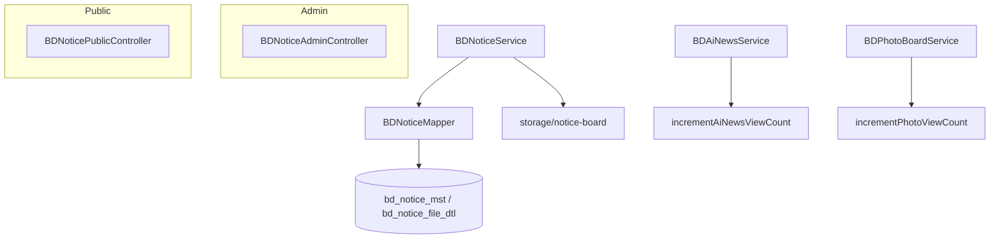

# 공지사항(BDNotice) 게시판 설계서 (Cursor)

**작성:** Cursor Agent · **상태:** 구현 반영 (2026-05-31)  
**별도 문서:** Claude 작성본은 [`notice_board_plan_claude.md`](notice_board_plan_claude.md) — 본 문서와 독립적으로 유지한다.

---

## 1. 배경·목표

공지사항 게시판이 없으므로 **BD + Notice** 네이밍으로 신규 구축한다. 포토게시판·AI News와 동일한 **수직 슬라이스**(Controller → Service → Mapper → Thymeleaf)이며, 공통 추상 레이어는 두지 않는다.

**참조 구현**

- CRUD·검색·페이징: `BDAiNews*`
- 파일 업로드·`publish_yn`·디스크 저장: `BDPhotoBoard*`

---

## 2. 요구사항 매핑

| 요구 | 설계 |
|------|------|
| BD 접두어, Notice 기능명 | `BDNotice*`, `bd_notice_*` |
| 상단 고정 | `pin_yn='Y'` — 공개 목록 **모든 페이지** 최상단, **검색 무시**, 행 배경색 구분 |
| 게시일 | `publish_dtm` — 정렬·표시 기준 (`yyyy-mm-dd`) |
| 노출여부 | `publish_yn='Y'`만 사용자 노출 (포토게시판과 동일 컬럼명) |
| 미래 게시일 | `publish_yn='Y'`여도 `publish_dtm` 미도래 시 **미노출** |
| 필드 | 제목, 내용, 썸네일(이미지 1장), 첨부(이미지+문서) |
| 조회수 | 공개 상세 진입 시 +1 — **공지·포토·AI News 공통** |
| 첨부 형식 | 이미지 + pdf, hwp/hwpx, doc/x, xls/x, ppt/x, zip 등 |

### 사용자 확인 (2026-05-31)

- 게시일이 오늘보다 미래 → 사용자 화면 숨김
- 썸네일 = 이미지 1장 전용, 첨부 = 이미지·문서 별도

---

## 3. 확정 설계 결정 (Cursor)

| 항목 | 결정 |
|------|------|
| 썸네일 | **`bd_notice_file_dtl` + `file_type='THUMB'`** (첨부와 동일 테이블, 유형으로 구분) |
| 첨부 | `bd_notice_file_dtl` (포토 file dtl과 동일 구조, `notice_seq` FK) |
| 컬럼명 | `publish_yn`, `pin_yn`, `view_cnt` |
| 공개 조건 | `delete_flg='N'` AND `publish_yn='Y'` AND `publish_dtm <= CURDATE()` (또는 `NOW()`) |
| 고정 목록 | 별도 쿼리 `selectPinnedPublicNotices` — keyword·LIMIT 없음 |
| 일반 목록 | `pin_yn='N'` + 검색 + 페이징; Service가 고정+페이지 목록 합침 |
| 조회수 중복 | **`BDBoardViewCountSupport` 쿠키**(공지·포토·AI News 공통, 24시간·최대 200건) |
| 사용자 목록 UI | 테이블 형식, 고정 블록 상단 + 페이지네이션 |

> **Claude 설계서와 차이:** Claude본은 `file_type`(THUMB/ATTACH), `exposure_yn`/`pinned_yn`, **쿠키 조회수 중복 제거**를 전제로 한다. 구현 착수 전 두 문서 중 하나로 컬럼·썸네일·조회수 정책을 통일할 것.

---

## 4. 아키텍처



---

## 5. URL·네비게이션

| 구분 | 경로 |
|------|------|
| 관리자 | `/admin/board/notice/list.do`, `write.do`, `insert.do`, `update.do`, `detail.do`, `delete.do`, `file.do`, `download.do`, `thumbnail.do` |
| 사용자 | `/board/notice/list.do`, `detail.do`, `file.do` |
| 메뉴 | `data.sql` — `news_notice`, `board_key='notice'`, `sort_ord=5` |
| 허브 | `templates/admin/board/index.html` |
| public GNB | `templates/fragments/layout.html` |

---

## 6. DB 스키마 (`schema.sql` 추가 예정)

### 6.1 `bd_notice_mst`

| 컬럼 | 설명 |
|------|------|
| `notice_seq` | PK |
| `title`, `content` | 제목, LONGTEXT |
| `publish_yn`, `publish_dtm` | 노출, 게시일 |
| `pin_yn` | 상단 고정 |
| `view_cnt` | 조회수 |
| (파일 테이블) | 썸네일 1장은 `bd_notice_file_dtl.file_type='THUMB'` |
| `delete_flg`, audit | 기존 보드 동일 |

인덱스: `(publish_dtm)`, `(publish_yn, pin_yn, publish_dtm)`.

### 6.2 `bd_notice_file_dtl`

`bd_photo_board_file_dtl` 패턴, `notice_seq` FK.

### 6.3 기존 보드

- `bd_photo_board_mst.view_cnt`
- `bd_ai_news_mst.view_cnt`

---

## 7. 백엔드 (구현 시 파일 목록)

| 레이어 | 클래스 |
|--------|--------|
| Admin | `BDNoticeAdminController` — `@RequestMapping("/admin/board/notice")` |
| Public | `BDNoticePublicController` |
| Service | `BDNoticeService` |
| Mapper | `BDNoticeMapper` + `mapper/bd/BDNoticeMapper.xml` |
| DTO | `Search`, `Save`, `List`, `Detail`, `Page`, `Public*`, `*SaveCommand` |

### 7.1 `application.yml`

```yaml
reven.upload.notice:
  root-path: ./storage/notice-board
  thumbnail-base-url: /admin/board/notice/thumbnail.do
  file-base-url: /admin/board/notice/file.do
  max-attachments: 10
  max-thumbnail-size-mb: 5
  max-attachment-size-mb: 20
```

### 7.2 공개 목록 쿼리

1. `selectPinnedPublicNotices` — `pin_yn='Y'`, 공개 조건, keyword 없음, `ORDER BY publish_dtm DESC`
2. `countPublicNotices` / `selectPublicNoticeList` — `pin_yn='N'`, 공개 조건, 제목 검색, LIMIT/OFFSET
3. 모든 페이지에서 1번 결과 동일하게 상단 렌더

### 7.3 공개 상세

- 미노출/미래/삭제 → `client/notice/invalid-access.html`
- 성공 시 `incrementNoticeViewCount` (관리자 상세는 미증가)

---

## 8. 조회수 공통 (포토 · AI News)

| 보드 | Mapper | 호출 |
|------|--------|------|
| Notice | `incrementNoticeViewCount` | `BDNoticePublicController.detail` |
| Photo | `incrementPhotoViewCount` | `BDPhotoBoardPublicController.detail` |
| AI News | `incrementAiNewsViewCount` | `BDAiNewsPublicController.detail` |

SQL: `UPDATE ... SET view_cnt = view_cnt + 1 WHERE ... AND delete_flg='N'` (+ AI News `status='Y'`, 포토/공지 `publish_yn='Y'`).

상세 템플릿에 조회수 표시.

---

## 9. UI

| 화면 | 경로 |
|------|------|
| 관리 | `templates/admin/notice/{list,detail,edit}.html` |
| 사용자 | `templates/client/notice/{list,detail,invalid-access}.html` |
| CSS | `.notice-row-pinned`, `.public-notice-pinned` — `app.css` |
| JS | `static/admin/js/notice-edit.js` |

관리 목록: 게시일 범위 검색, 고정 행 `notice-row-pinned`.

---

## 10. 구현 순서 (미실행)

1. `schema.sql` — Notice + `view_cnt` on photo/ai_news
2. Mapper / Service / DTO
3. Controller, Thymeleaf, upload 설정, JS/CSS
4. `data.sql`, hub, public GNB
5. Photo/AI News 조회수
6. 테스트, `docs/worklog.md`

---

## 11. 검증

- `./gradlew test`
- 고정 글: 2페이지·검색 후에도 상단·배경색
- 미래 게시일·`publish_yn=N` 미노출
- 공개 상세 조회수 +1
- 포토·AI News 조회수 동작

---

## 12. 참조 경로

- `src/main/java/com/reven/project/service/bd/BDPhotoBoardService.java`
- `src/main/java/com/reven/project/service/bd/BDAiNewsService.java`
- `src/main/resources/mapper/bd/BDPhotoBoardMapper.xml`
- `src/main/resources/mapper/bd/BDAiNewsMapper.xml`
- `src/main/resources/schema.sql`, `data.sql`

---

## 13. 관련 문서

| 문서 | 설명 |
|------|------|
| [`notice_board_plan_claude.md`](notice_board_plan_claude.md) | Claude Agent 설계 (file_type 썸네일, 쿠키 조회수 등) |
| `.cursor/plans/bd_notice_board_4ed55366.plan.md` | Cursor Plan 도구 원본 |
