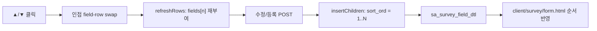

# 관리자 설문 문항 순서 변경 P4 설계

작성일: 2026-06-02

## 목표

관리자 설문 상세 화면에서 문항(필드) 순서를 위/아래 버튼으로 변경하고, 저장 시 DB `sort_ord`와 사용자 설문 화면 순서에 반영한다.

## 현재 상태

- `sa_survey_field_dtl.sort_ord` 컬럼과 DTO `SurveyFieldSaveRequest.sortOrd`가 이미 존재한다.
- 조회는 `SASurveyMapper.xml`에서 `order by sort_ord, field_seq`로 정렬한다.
- 저장은 `SASurveyService.insertChildren()`에서 `fields` 리스트 순서대로 `sort_ord`를 1, 2, 3…으로 부여한다. 요청에 `sortOrd > 0`이 있으면 그 값을 쓰고, 없으면 루프 인덱스를 쓴다.
- 관리 화면 [`detail.html`](../../../src/main/resources/templates/admin/survey/detail.html)은 `th:each="field, stat : ${survey?.fields}"`로 DB 순서대로 문항을 나열한다.
- [`survey-field-editor.js`](../../../src/main/resources/static/admin/js/survey-field-editor.js)는 문항 추가/삭제와 `fields[n].*` name 재부여만 지원한다. 순서 변경 UI는 없다.
- 폼 POST에는 `fields[n].sortOrd` hidden input이 없다. 실질적 순서는 HTML row 순서 → Spring `fields` 리스트 순서로 결정된다.
- 수정 저장 시 문항·보기는 delete 후 reinsert하는 v1 정책이다. `field_seq`는 저장마다 바뀔 수 있다.
- 제출 시 `SASurveySubmitService`가 `field.sortOrd`를 답변 스냅샷에 저장한다. 설문 정의 순서를 바꿔도 기존 제출 이력 순서는 유지된다.

## 선택한 방향

문항 순서 변경 UI는 **위/아래 버튼**으로 구현한다. drag-and-drop, 별도 reorder API, hidden `sortOrd` 필드는 사용하지 않는다.

### 대안 비교

1. **위/아래 버튼**
   - 장점은 외부 라이브러리가 필요 없고, 관리자 버튼 규칙과 맞으며, 접근성·모바일에서 단순하다.
   - 단점은 많은 문항을 한 번에 크게 옮기기는 드래그보다 번거롭다.

2. **HTML5 drag-and-drop**
   - 장점은 직관적인 재배치 UX다.
   - 단점은 프로젝트 내 선례가 없고, 키보드·터치 접근성 구현 비용이 크다.

3. **hidden `sortOrd` POST**
   - 장점은 DOM과 독립적으로 순서를 명시할 수 있다.
   - 단점은 DOM row 순서와 `refreshRows()` 재부여만으로 이미 `insertChildren` fallback과 동일한 결과를 낸다.

4. **전용 reorder endpoint**
   - 장점은 순서만 빠르게 저장할 수 있다.
   - 단점은 full form POST와 이중 경로가 생기고, P2/P3와 다른 저장 패턴이 된다.

권장안은 1번이다. 순서 변경은 DOM에서 row를 swap한 뒤 기존 **수정/등록** POST로 저장한다.

## 동작 흐름



## UI 설계

### 문항 row 헤더

[`detail.html`](../../../src/main/resources/templates/admin/survey/detail.html)의 `.field-row-head`에 순서 버튼을 추가한다. 기존 문항 row, 빈 신규 row, `<template data-field-template>` 세 곳 모두 동일 구조를 유지한다.

```html
<div class="field-row-head">
    <strong>문항 1</strong>
    <div class="field-row-actions">
        <button class="btn btn-neutral btn-compact" type="button" data-move-field-up disabled aria-label="위로">▲</button>
        <button class="btn btn-neutral btn-compact" type="button" data-move-field-down aria-label="아래로">▼</button>
        <button class="btn btn-delete" type="button" data-remove-field>삭제</button>
    </div>
</div>
```

- 첫 문항: `data-move-field-up` disabled
- 마지막 문항: `data-move-field-down` disabled
- 문항이 1개일 때: 위/아래 모두 disabled (삭제 버튼은 기존과 같이 disabled)
- **즉시 저장 없음**. 순서 변경 후 사용자가 하단 **수정/등록** 버튼으로 저장한다.

### 스타일

[`app.css`](../../../src/main/resources/static/common/css/app.css)에 최소 추가.

- `.field-row-actions`: flex, gap, align-items center
- `.btn-compact`: 순서 버튼용 작은 패딩 (삭제 버튼과 시각적 구분)
- 순서 버튼은 `btn-neutral` (중립 톤). 삭제(빨강)·등록(파랑)과 구분한다.

## JS 설계

[`survey-field-editor.js`](../../../src/main/resources/static/admin/js/survey-field-editor.js) 확장.

### move up / move down

- editor에 `click` 위임 핸들러 추가. `data-move-field-up`, `data-move-field-down` 처리.
- 현재 row와 이전/다음 `[data-field-row]`를 `insertAdjacentElement`로 swap.
- swap 후 `refreshRows(editor)` 호출.

### refreshRows 확장

기존 동작 유지.

- 문항 번호(`문항 1`, `문항 2`, …) 갱신
- `fields[n].*` name 재부여
- 삭제 버튼 disabled (1개일 때)

추가.

- 각 row의 `data-move-field-up`: index === 0 이면 disabled
- 각 row의 `data-move-field-down`: index === rows.length - 1 이면 disabled

### bindRowEvents

row 이동 시 DOM만 바뀌므로 `surveyType` change 리스너는 row에 붙은 채 유지된다. move 후 `bindRowEvents` 재호출은 불필요하다.

## 백엔드

**변경 없음.**

- Controller, Service, Mapper, DTO 수정 불필요
- DOM row 순서 = `SurveySaveRequest.fields` 리스트 순서 = `insertChildren`의 `fieldOrder` fallback
- P2 옵션 검증과 독립. 순서만 바꾼 저장은 기존 검증 경로를 그대로 탄다.

## 제출 스냅샷

- 설문 정의의 `sort_ord` 변경은 **이후 신규 제출**에만 적용된다.
- 이미 저장된 `sa_survey_answer_dtl.sort_ord` 스냅샷은 변경하지 않는다. 이력 상세·CSV는 제출 당시 순서를 유지한다.

## 변경 범위

### 수정 대상

| 파일 | 내용 |
|------|------|
| `src/main/resources/templates/admin/survey/detail.html` | field-row-head up/down 버튼, template 동기화 |
| `src/main/resources/static/admin/js/survey-field-editor.js` | move up/down, refreshRows disabled 갱신 |
| `src/main/resources/static/common/css/app.css` | `.field-row-actions`, `.btn-compact` (필요 시) |
| `src/test/java/com/reven/project/admin/sa/SAAdminSurveyControllerTest.java` 또는 `SASurveyServiceTest.java` | 저장 후 `sort_ord` 순서 검증 |

### 수정하지 않음

- `SAAdminSurveyController.java`
- `SASurveyService.java`
- `SASurveyMapper.xml`
- `SASurveyDto.java`
- `client/survey/form.html` (이미 `survey.fields` 순서대로 렌더)

## 테스트 기준

### UI 동작

- ▲ 클릭 시 해당 문항이 한 칸 위로 이동한다.
- ▼ 클릭 시 해당 문항이 한 칸 아래로 이동한다.
- 첫 문항에서 ▲, 마지막 문항에서 ▼는 disabled다.
- 이동 후 문항 번호와 `fields[n].*` name이 0부터 연속으로 재부여된다.

### 저장·조회

- 문항 순서를 바꾼 뒤 저장하면 DB `sort_ord`가 화면 순서와 1, 2, 3…으로 일치한다.
- 저장 후 사용자 설문 GET에서 문항 표시 순서가 관리 화면과 같다.
- 문항 추가/삭제 후 순서 버튼·저장이 정상 동작한다.

### 회귀

- P2 객관식 옵션 검증(0개, 중복 라벨)이 깨지지 않는다.
- P1 객관식/주관식 렌더링과 제출이 깨지지 않는다.
- 기존 정상 설문 저장·수정 흐름이 유지된다.

## 완료 기준

- 관리자 설문 상세에서 위/아래 버튼으로 문항 순서를 변경할 수 있다.
- 저장 후 DB와 사용자 설문 화면에 순서가 반영된다.
- 첫/마지막 문항 버튼 disabled와 add/remove 회귀가 통과한다.
- `./gradlew test` 회귀 통과.

## 비범위

- Drag-and-drop
- 보기(`optionsText`) 줄 순서 UI — textarea 줄 순서가 이미 `option.sort_ord`로 저장됨
- 별도 “순서만 저장” API / AJAX
- `field_seq` 보존형 UPDATE 저장
- 제출 이력·통계 화면 순서 재정렬 (P8)
- 설문 미리보기 (P5)
